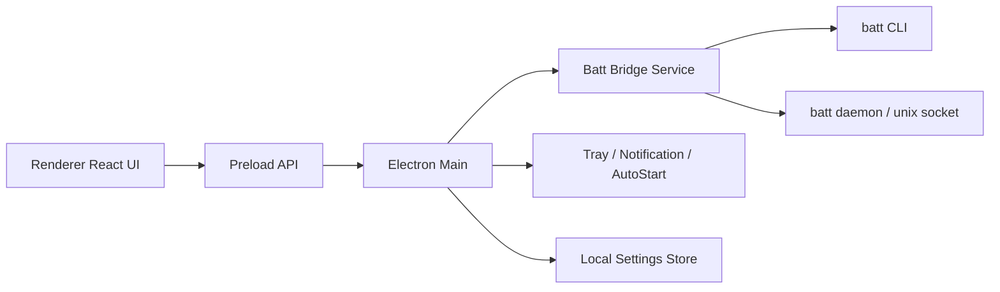

# Batt Helper 技术设计文档

## 1. 文档目标

本文档用于指导 Batt Helper 的工程实现，覆盖架构、模块边界、IPC 设计、数据模型、目录规划、打包与后续扩展策略。

## 2. 技术栈

- Electron
- TypeScript
- React
- Vite
- Zustand
- i18next
- Tailwind CSS
- electron-builder
- electron-store
- zod

## 3. 总体架构



## 4. 分层说明

### 4.1 Renderer 层

负责：

- 页面渲染
- 状态管理
- 图表和组件
- 用户交互
- 主题切换
- 国际化

### 4.2 Preload 层

负责：

- 暴露白名单 API
- 屏蔽 Electron / Node 能力
- 避免 renderer 直接接触系统接口

### 4.3 Main 层

负责：

- 窗口生命周期
- Tray
- 自启动
- IPC 路由
- 通知
- 配置持久化
- 错误处理

### 4.4 Batt Bridge 层

负责：

- 调用 `batt` CLI
- 状态聚合
- 数据格式转换
- 与 UI 解耦

## 5. 与 batt 的集成策略

### 5.1 设计原则

- 读操作优先使用稳定输出
- 写操作优先使用明确命令
- 不直接修改 batt 源码
- 尽量减少对内部私有结构的耦合

### 5.2 推荐实现

- 状态读取：`batt status --json`
- 写入指令：直接调用 `batt` 子命令
- 扩展信息：必要时补充 daemon/socket 读接口

### 5.3 命令映射

- `batt status --json`
- `batt limit <n>`
- `batt disable`
- `batt lower-limit-delta <n>`
- `batt adapter enable|disable|status`
- `batt calibration start|pause|resume|cancel|status`
- `batt calibration discharge-threshold <n>`
- `batt calibration hold-duration <n>`
- `batt schedule <cron>`
- `batt schedule show`
- `batt schedule disable`
- `batt prevent-idle-sleep enable|disable`
- `batt disable-charging-pre-sleep enable|disable`
- `batt prevent-system-sleep enable|disable`
- `batt version`
- `batt install --allow-non-root-access`
- `batt uninstall`

## 6. 推荐目录结构

```text
src/
  main/
    index.ts
    window.ts
    tray.ts
    menu.ts
    ipc/
      batt.ts
      settings.ts
      app.ts
    services/
      batt-bridge/
        index.ts
        cli.ts
        mapper.ts
        types.ts
      autostart.ts
      notification.ts
      logger.ts
    store/
      settings.ts
  preload/
    index.ts
  renderer/
    main.tsx
    app/
      App.tsx
      routes.tsx
    pages/
      Dashboard/
      Charging/
      Health/
      Calibration/
      Settings/
      About/
      Onboarding/
    components/
      ui/
      business/
      layout/
    store/
      app.store.ts
      batt.store.ts
      settings.store.ts
    services/
      api.ts
      i18n.ts
      theme.ts
    locales/
      zh-CN.json
      en-US.json
    styles/
      globals.css
      tokens.css
```

## 7. 数据模型

### 7.1 BattStatus

```ts
export interface BattStatus {
  charging: {
    allowCharging: boolean
    useAdapter: boolean
    pluggedIn: boolean
  }
  battery: {
    currentChargePercent: number
    state: 'charging' | 'discharging' | 'full' | 'notCharging'
    timeToLimitMinutes?: number
    fullCapacityMah: number
    chargeRateWatts: number
    voltageVolts: number
  }
  configuration: {
    enabled: boolean
    upperLimitPercent: number
    lowerLimitPercent: number
    preventIdleSleep: boolean
    disableChargingPreSleep: boolean
    preventSystemSleep: boolean
    allowNonRootAccess: boolean
    controlMagSafeLed?: {
      enabled: boolean
      mode: string
    }
  }
  calibration?: {
    phase: string
    startedAt?: string
    paused: boolean
    canPause: boolean
    canCancel: boolean
    message: string
    schedule: {
      enabled: boolean
      cron: string
      scheduledAt?: string
    }
  }
}
```

### 7.2 AppSettings

```ts
export interface AppSettings {
  theme: 'system' | 'light' | 'dark'
  locale: 'zh-CN' | 'en-US' | 'zh-TW'
  launchAtLogin: boolean
  startInTray: boolean
  minimizeToTray: boolean
  notificationsEnabled: boolean
  quickPresets: number[]
}
```

## 8. IPC 设计

### 8.1 Channel 列表

- `batt:getStatus`
- `batt:setLimit`
- `batt:disableLimit`
- `batt:setLowerLimitDelta`
- `batt:setAdapter`
- `batt:calibrationStart`
- `batt:calibrationPause`
- `batt:calibrationResume`
- `batt:calibrationCancel`
- `batt:setCalibrationThreshold`
- `batt:setCalibrationHoldDuration`
- `batt:scheduleSet`
- `batt:scheduleShow`
- `batt:scheduleDisable`
- `batt:installDaemon`
- `batt:uninstallDaemon`
- `settings:get`
- `settings:set`
- `app:getVersion`
- `app:openWindow`

### 8.2 Preload API 示例

```ts
contextBridge.exposeInMainWorld('appAPI', {
  batt: {
    getStatus: () => ipcRenderer.invoke('batt:getStatus'),
    setLimit: (limit: number) => ipcRenderer.invoke('batt:setLimit', limit),
    disableLimit: () => ipcRenderer.invoke('batt:disableLimit'),
    setLowerLimitDelta: (delta: number) => ipcRenderer.invoke('batt:setLowerLimitDelta', delta),
    installDaemon: () => ipcRenderer.invoke('batt:installDaemon'),
  },
  settings: {
    get: () => ipcRenderer.invoke('settings:get'),
    set: (payload) => ipcRenderer.invoke('settings:set', payload),
  },
})
```

## 9. Main 进程模块设计

### 9.1 window.ts

负责：

- 主窗口创建
- 最小尺寸限制
- 关闭时最小化到 Tray
- 路由入口加载

### 9.2 tray.ts

负责：

- 创建 Tray
- 使用单一图标 `tray-logo-template.svg`
- 构建右键菜单
- 打开主窗口

### 9.3 batt-bridge/cli.ts

负责：

- 使用 `child_process.execFile` 调用 batt 命令
- 收集 stdout / stderr / exit code
- 标准化错误输出

#### 关键要求

- 使用参数数组，不拼接 shell 字符串
- 所有命令白名单化
- 对错误统一包装

### 9.4 batt-bridge/mapper.ts

负责：

- 将 `batt status --json` 转换为统一前端 DTO
- 将 CLI 返回值标准化为 UI 可消费结构

### 9.5 settings.ts

负责：

- 使用 `electron-store` 管理设置
- 负责默认值、迁移、版本兼容

## 10. Renderer 设计

### 10.1 状态管理

建议使用 Zustand：

- `batt.store.ts`
  - status
  - loading
  - error
  - refresh()
- `settings.store.ts`
  - theme
  - locale
  - launchAtLogin
  - quickPresets

### 10.2 页面职责

- `Dashboard`
  - 状态汇总
  - 电量与健康卡片
  - 快捷预设
- `Charging`
  - 上限与 delta 设置
  - 供电控制
- `Health`
  - 健康度与循环数据
- `Calibration`
  - 校准状态与调度
- `Settings`
  - 外观、语言、自启动、日志
- `About`
  - 作者、版本、开源引用

## 11. 轮询与刷新策略

### 11.1 状态轮询

- 主窗口打开：每 `5s`
- 仅状态栏常驻：每 `15s`
- 执行设置操作后：立即刷新一次

### 11.2 错误降级

- 某次请求失败，不立刻清空旧状态
- 显示“最近一次成功状态 + 错误提示”
- 连续失败达到阈值再切换为异常空状态

## 12. 错误处理规范

### 12.1 错误分类

- `DAEMON_NOT_INSTALLED`
- `DAEMON_NOT_RUNNING`
- `PERMISSION_DENIED`
- `VERSION_MISMATCH`
- `UNSUPPORTED_DEVICE`
- `COMMAND_FAILED`

### 12.2 UI 表现

- Banner：全局异常
- Toast：操作结果
- Dialog：高风险确认或失败恢复

## 13. 主题与品牌接入

### 13.1 Logo / Icon 资源

- 主 Logo：`/Users/xiaoweizhang/work/batt-helper/design/brand/app-logo-primary.svg`
- 状态栏单色模板：`/Users/xiaoweizhang/work/batt-helper/design/brand/tray-logo-template.svg`

### 13.2 使用原则

- App 图标使用彩色品牌资源
- Tray 图标使用单色模板资源
- 深浅菜单栏环境自动切换黑白版本

## 14. 国际化设计

### 14.1 资源结构

- `renderer/locales/zh-CN.json`
- `renderer/locales/en-US.json`

### 14.2 Key 规范

- `dashboard.title`
- `charging.limit.label`
- `settings.appearance.theme.dark`
- `errors.daemonNotRunning`

## 15. 安全设计

- `contextIsolation: true`
- `nodeIntegration: false`
- 所有 IPC 参数使用 zod 校验
- 不允许 renderer 直接执行系统命令
- batt 调用严格白名单

## 16. 日志设计

### 16.1 Main 日志

记录：

- batt 调用命令
- 返回码
- stderr 摘要
- 关键用户操作

### 16.2 日志目录

- `~/Library/Logs/Batt Helper/`

## 17. 打包与分发

### 17.1 构建产物

- `dmg`
- `zip`

### 17.2 后续要求

- Apple 签名
- notarization
- 自动更新（二期）

## 18. 开发建议顺序

### Phase 1

- 初始化 Electron + React + TS
- 接入 preload / IPC
- 打通 batt status 读取

### Phase 2

- 完成 Dashboard / Charging / About
- 接入设置存储
- 接入主题与 i18n

### Phase 3

- 接入 Tray
- 接入 launch at login
- 接入 daemon 安装引导

### Phase 4

- 完成 Calibration / Schedule
- 完成 Advanced 设置

### Phase 5

- 打包、签名、公证
- 稳定性优化

## 19. 首版验收清单

- 能正确读取 `batt status --json`
- 能设置 charge limit
- 能设置 lower limit delta
- 能正确显示主界面状态
- 能显示稳定的 Tray 图标
- 能完成开机自启动设置
- 能切换中英文与深浅主题
- About 页信息完整且署名准确
